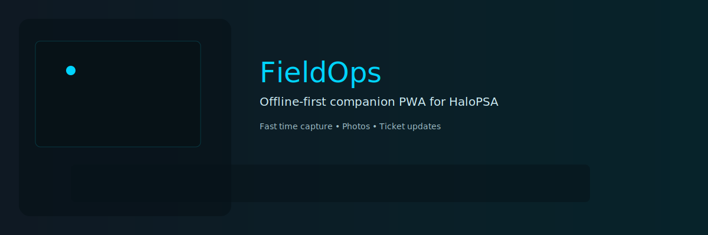

# FieldOps

FieldOps is now structured as an **Azure-native Progressive Web App** for HaloPSA:

- **Azure Static Web Apps Free** hosts the frontend
- **Microsoft Entra ID** authenticates technicians into FieldOps
- **Azure Functions** acts as the backend-for-frontend (BFF)
- **Halo OAuth** is completed once per user and stored server-side
- **Azure Table Storage** and **Key Vault** hold the minimum secure state needed for the connection model

The browser no longer stores Halo refresh tokens or talks directly to Halo APIs.

## Repo shape

- [`src/`](/home/thomas/fieldops/src) React + TypeScript frontend
- [`shared/contracts.ts`](/home/thomas/fieldops/shared/contracts.ts) shared app contracts
- [`api/`](/home/thomas/fieldops/api) Azure Functions API
- [`infra/main.bicep`](/home/thomas/fieldops/infra/main.bicep) low-cost Azure resource template
- [`docs/option-2-viability.md`](/home/thomas/fieldops/docs/option-2-viability.md) bounded spike for evaluating Entra-to-Halo delegated API viability

## Local development

1. Install frontend dependencies:
   ```bash
   npm install
   ```
2. Install API dependencies:
   ```bash
   cd api && npm install
   ```
3. Copy [`api/local.settings.example.json`](/home/thomas/fieldops/api/local.settings.example.json) to `api/local.settings.json` and fill in real values if you want to hit Halo.
4. Start the frontend:
   ```bash
   npm run dev
   ```
5. For local API work, run the Azure Functions host from `api/` with Azure Functions Core Tools. The frontend is already wired to call `/api/*` routes.

If `FIELDOPS_USE_MOCK_DATA=true`, the Functions layer uses mock tickets and a mock connected user for low-friction local development.

## Production deployment model

### Static Web Apps

- Use [`staticwebapp.config.json`](/home/thomas/fieldops/staticwebapp.config.json) to require authenticated access and redirect anonymous users to `/.auth/login/aad`.
- Start on **SWA Free**.
- Upgrade to **SWA Standard** only if Free-tier auth/quotas/support become a blocker.

### API

The Functions layer exposes the v1 BFF routes:

- `GET /api/session`
- `POST /api/halo/connect/start`
- `GET /api/halo/connect/callback`
- `POST /api/halo/disconnect`
- `GET /api/tickets`
- `GET /api/tickets/{ticketId}`
- `GET /api/action-types`
- `GET /api/outcomes`
- `POST /api/time-entries`
- `POST /api/photos`
- `POST /api/sync`

## Security notes

- Halo refresh tokens are encrypted before persistence.
- The frontend stores only job drafts and offline retry work.
- Photo uploads are streamed through the API and are not retained long-term in Azure.
- Application Insights sampling is enabled in [`api/host.json`](/home/thomas/fieldops/api/host.json) to reduce telemetry spend.

## Tests

Run:

```bash
npm test
```

The Playwright suite validates the Azure-native UI flow with mocked `/api/*` responses and a Vite dev server.
